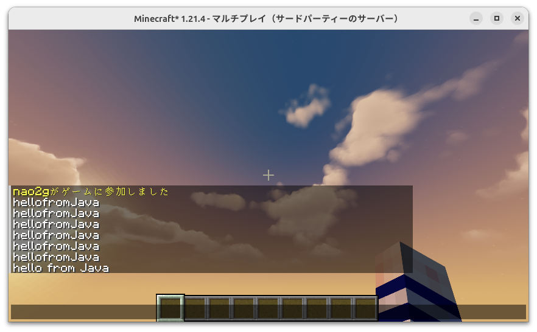
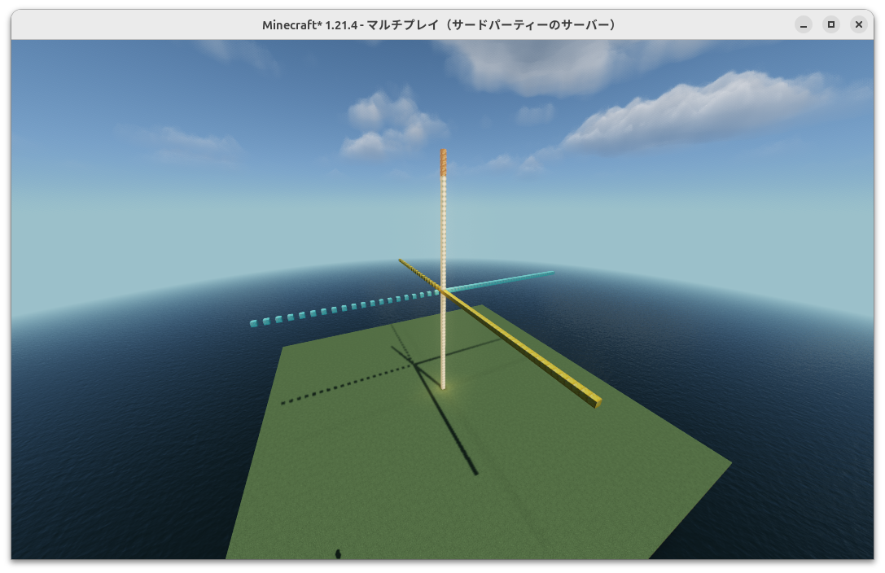

# Minecraft Remote for Java

[][]

IntelliJ IDEAで開発。VS Codeでは、何故かうまく行かないことが多く挫折。

うまく行かなかったのは、IntelliJの「実行」によるターミナルもどきが特別なせいだった。
IntelliJの「ターミナル」だと、外のターミナルやVS Codeのターミナルと同じ挙動になる。
scanner.next()ではなく、scanner.nextLine()にするとうまく行った。

./gradle run だけでなく、.jarファイルを作成してターミナルで実行した場合も同じ。

./gradle run
あるいは、
java -jar build/libs/minecraft-remote-1.0-SNAPSHOT.jar

